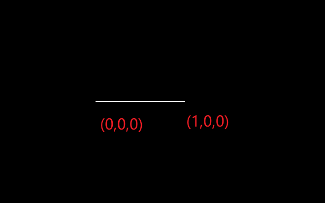
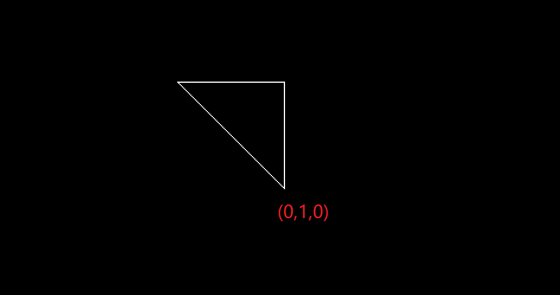

旋转矩阵z

```
Eigen::Matrix4f get_model_matrix(float rotation_angle)
{
    Eigen::Matrix4f model = Eigen::Matrix4f::Identity();

    // TODO: Implement this function
    // Create the model matrix for rotating the triangle around the Z axis.
    // Then return it.
    Eigen::Matrix4f rotation;
    double fangle = rotation_angle / 180 * MY_PI;//角度转弧度，便于计算

    rotation << cos(fangle), -sin(fangle), 0, 0,
        sin(fangle), cos(fangle), 0, 0,
        0, 0, 1, 0,
        0, 0, 0, 1;//模型旋转矩阵（绕z轴）

    model = rotation * model;

    return model;
}
```




