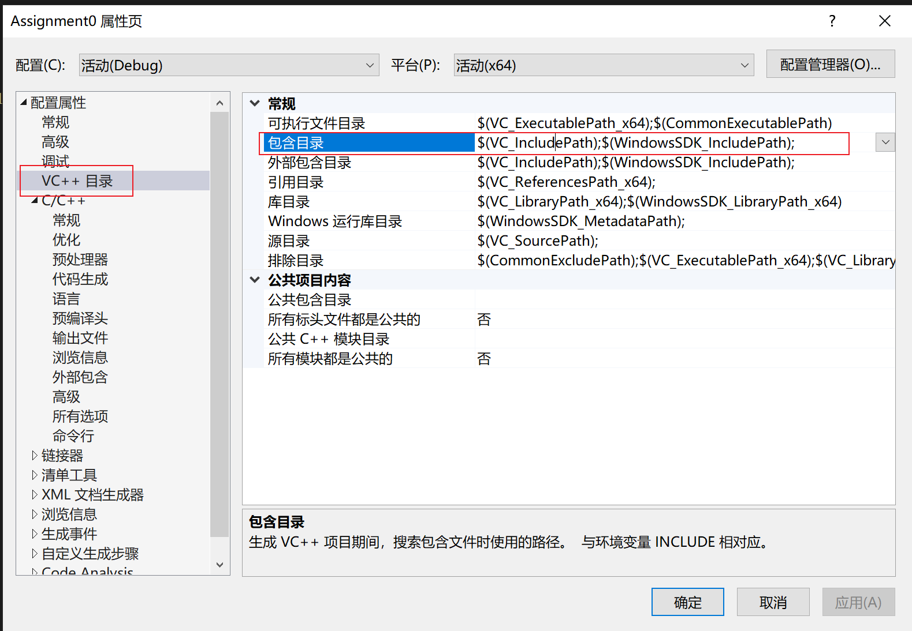
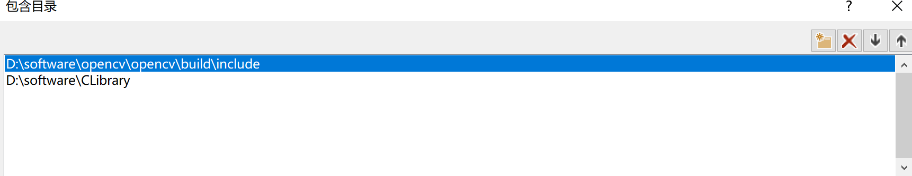
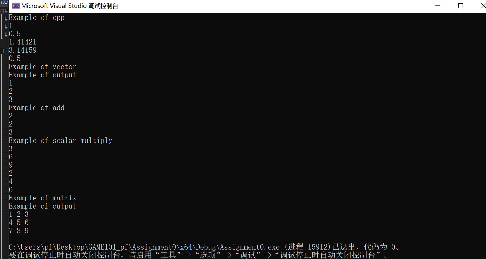
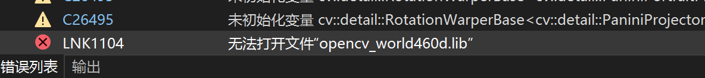
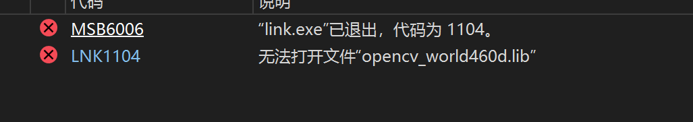

# Assignment0



```
D:\software\CLibrary
D:\software\opencv\opencv\build\include
```



编译成功



# Assignment1

## 错误1


### 解决办法：

参考;https://blog.csdn.net/hjl011006/article/details/127015522


## 错误2






解决办法

vc

c/c++

连接器

把vc15的lib库添加到上面三个附加库中，vc15如下

```
D:\software\opencv\opencv\build\x64\vc15\lib
```

